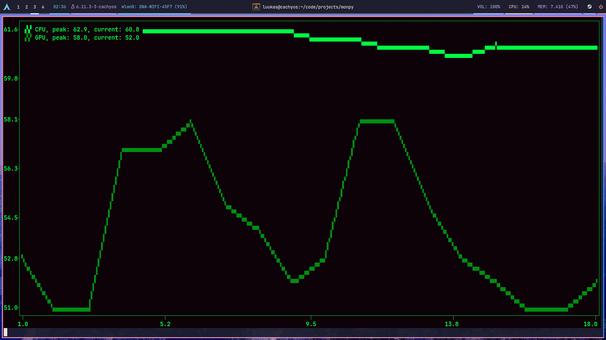
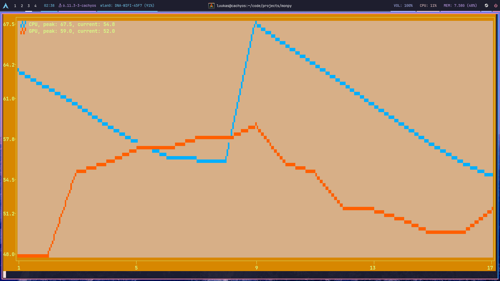
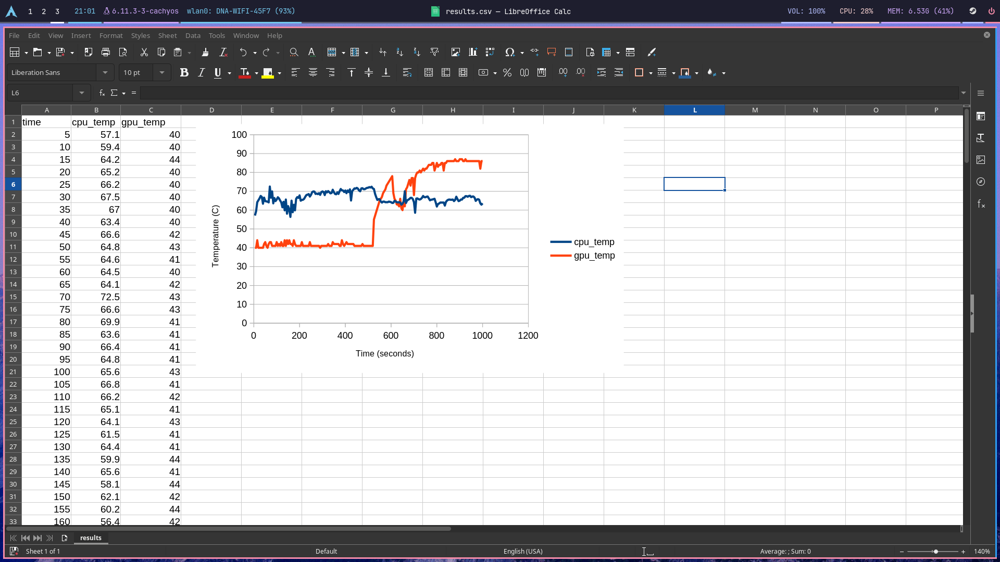

# MonPy
**MonPy** is a command line based system monitoring tool. It allows you to
monitor your CPU and GPU temperatures.

You can view these temperatures in real time printed as a nice looking graphs
whose theme you can change. 

You can also write these changes in to a `.csv` file for later to be used
together with, for example a spreadsheet software so you can better visualize
the recorded data.

> [!IMPORTANT]
> This project **only works with Linux**, AMD and Intel CPUs compatible
> with the `k10temp` or `coretemp` kernel drivers and nvidia cards with the proprietary
> drivers, as of right now.

Support for other hardware and platforms is not planned as this was my [cs50p final project](https://cs50.harvard.edu/python/2022/project/).

## Screenshot
Theme: pro
 

Theme: matrix
 

Theme: retro
 

 

## Installation
### requirements:
- `python > 3.12`

- `linux`

Initialize the project with:
```bash
./install.sh
```
This will create a python virual environment, if non existent, and install all the
dependencies.

Start the project with:
```bash
python project.py
```

See help for the command with:
```bash
python project.py --help
```
